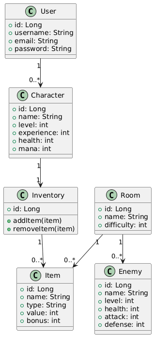
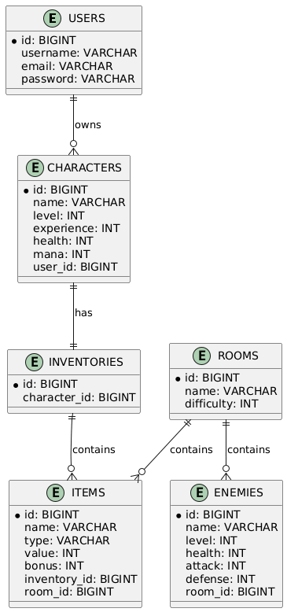
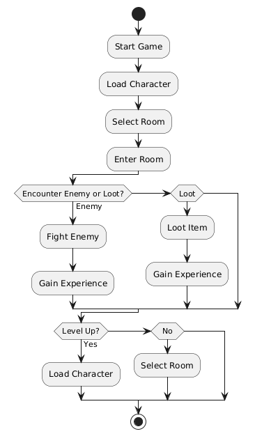

# 🧙‍♂️ HeroQuest - Backend

HeroQuest Backend es la base lógica y de datos del proyecto **HeroQuest**, un RPG inspirado en el clásico juego de mesa.  
Su propósito es gestionar la autenticación de usuarios, los personajes, enemigos, ítems, salas y progreso del jugador.  
Desarrollado con **Spring Boot** y una base de datos **MySQL**, proporciona una API REST segura y escalable.

## 🧩 Tecnologías utilizadas

- ☕ **Java 21**
- 🌱 **Spring Boot**
  - Spring Web
  - Spring Data JPA
  - Spring Security (JWT)
  - Validation
- 🐬 **MySQL**
- 🧪 **JUnit 5** y **Mockito** (tests unitarios)
- 🧰 **Maven**
- 🧠 **Lombok**
- 🖥️ **DBeaver** (gestión gráfica de base de datos)
- 🧭 **Postman** (testeo de endpoints)
- 🗂️ **Jira** (gestión del proyecto)

## ⚙️ Instalación y configuración

### 🔧 Prerrequisitos
- Tener instalado **Java 21** y **Maven**  
- Tener instalado **MySQL** (o PostgreSQL)  
- Opcional: **DBeaver** para gestionar la base de datos de forma gráfica

### 🚀 Clonar el repositorio

git clone https://github.com/Alejandro-Cuesta/HeroQuest-Backend.git
cd HeroQuest-Backend

##  Estructura

heroquest-backend/
├── src/
│ ├── main/
│ │ ├── java/dev/alejandro/heroquest/
│ │ │ ├── config/
│ │ │ │ ├── SecurityConfig.java
│ │ │ │ └── WebConfig.java
│ │ │ ├── controller/
│ │ │ │ ├── AuthController.java
│ │ │ │ ├── CharacterController.java
│ │ │ │ ├── RoomController.java
│ │ │ │ ├── InventoryController.java
│ │ │ │ └── RunController.java
│ │ │ ├── dto/
│ │ │ │ ├── UserLoginDTO.java
│ │ │ │ ├── UserRegisterDTO.java
│ │ │ │ ├── CharacterDTO.java
│ │ │ │ ├── RoomDTO.java
│ │ │ │ └── ItemDTO.java
│ │ │ ├── model/
│ │ │ │ ├── User.java
│ │ │ │ ├── Character.java
│ │ │ │ ├── Room.java
│ │ │ │ ├── Enemy.java
│ │ │ │ ├── Item.java
│ │ │ │ ├── Inventory.java
│ │ │ │ ├── InventoryItem.java
│ │ │ │ └── Run.java
│ │ │ ├── repository/
│ │ │ │ ├── UserRepository.java
│ │ │ │ ├── CharacterRepository.java
│ │ │ │ ├── RoomRepository.java
│ │ │ │ ├── EnemyRepository.java
│ │ │ │ ├── ItemRepository.java
│ │ │ │ ├── InventoryRepository.java
│ │ │ │ └── RunRepository.java
│ │ │ ├── service/
│ │ │ │ ├── AuthService.java
│ │ │ │ ├── CharacterService.java
│ │ │ │ ├── RoomService.java
│ │ │ │ ├── InventoryService.java
│ │ │ │ └── RunService.java
│ │ │ └── HeroQuestApplication.java
│ │ └── resources/
│ │ ├── application.yml
│ │ ├── data.sql
│ │ └── schema.sql
│ └── test/
│ ├── java/dev/alejandro/heroquest/
│ │ ├── service/
│ │ │ ├── CharacterServiceTest.java
│ │ │ └── RoomServiceTest.java
│ │ ├── controller/
│ │ │ └── AuthControllerTest.java
│ │ └── repository/
│ │ └── UserRepositoryTest.java
├── Dockerfile
├── docker-compose.yml
├── pom.xml
└── README.md

## 🧩 Diagramas

### Diagrama de Clases

### Diagrama de Relaciones (Patas de Gallo)

### Diagrama de Flujo

### Cobertura de Tests

##  Autor

Alejandro Cuesta Cabeza

https://github.com/Alejandro-Cuesta

